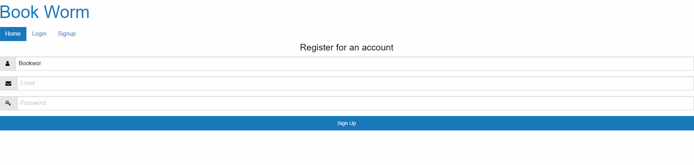
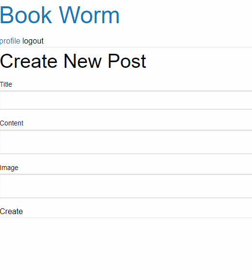
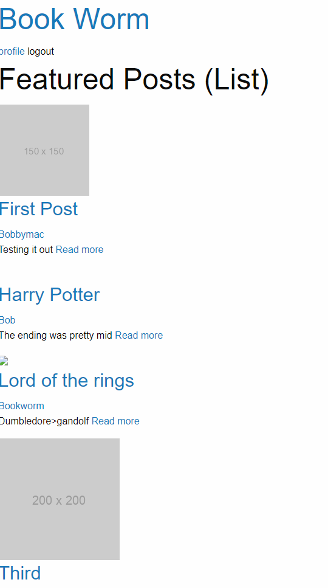

# BookWorm

- [Description](#description) 
- [Installation](#installation) 
- [Usage](#usage) 
- [Contributors](#contributors)

## Description
BookWorm is an app that connects readers! With our app, users can upload book reviews for other users to see and interact with. 

## Installation
Clone the repo, use "npm i", set up your server and use "npm run"

## Usage
Register an account:

Navigate to your profile:

Go to the homepage by clicking "BookWorm" in the top left of the window:

## Contributors
[@ItsssBobby](https://github.com/ItsssBobby)

[@JamaiaB](https://github.com/JamaiaB)

